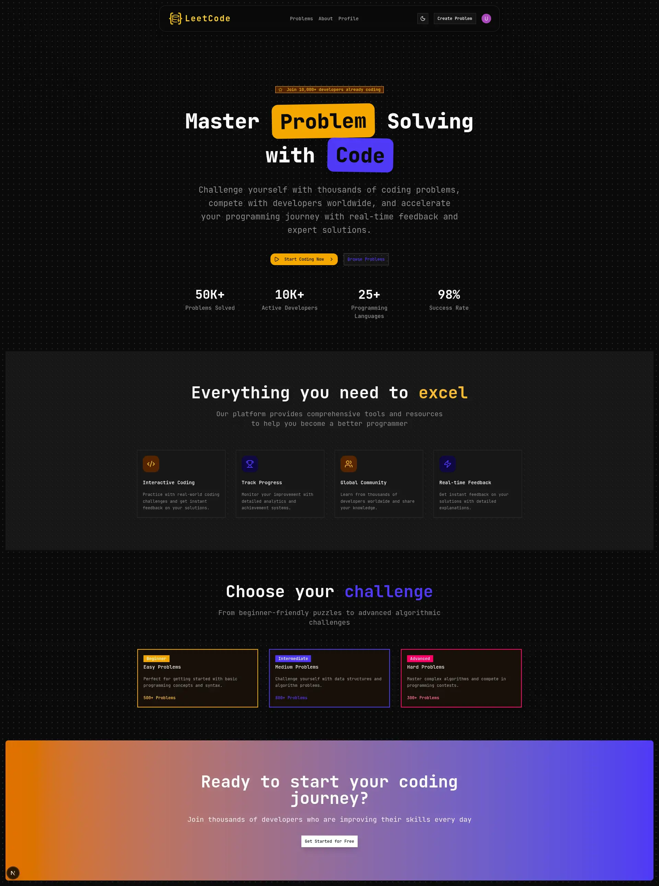
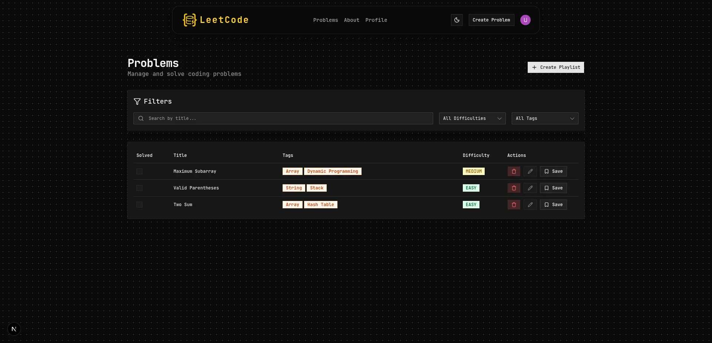
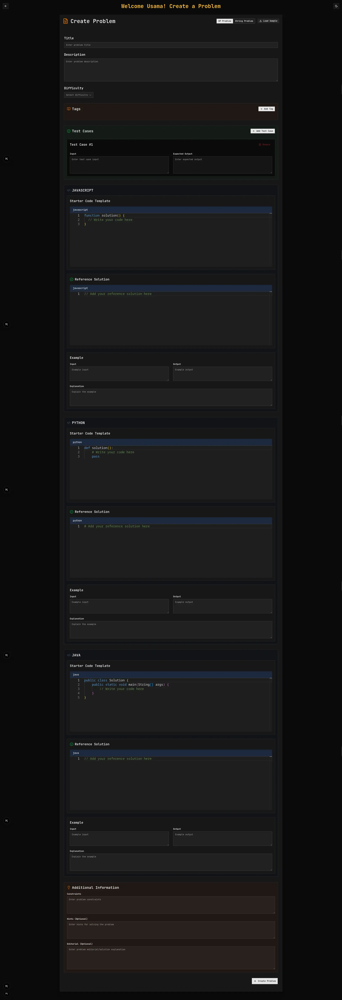
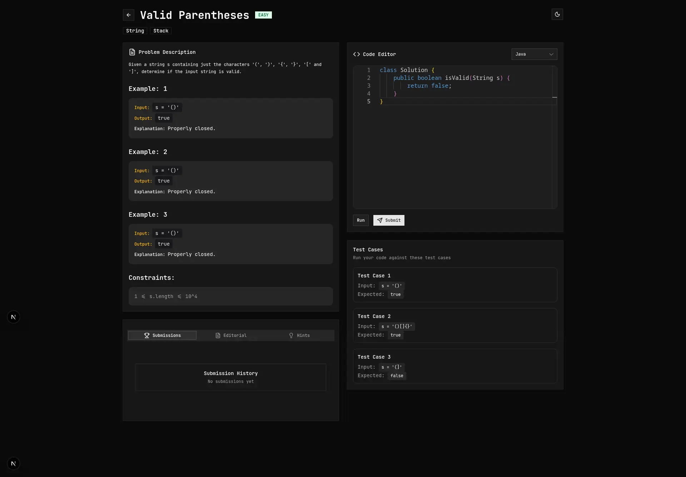
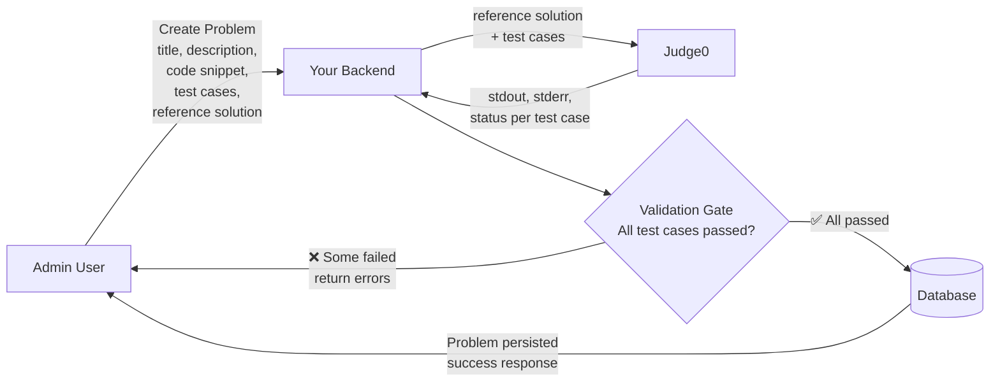
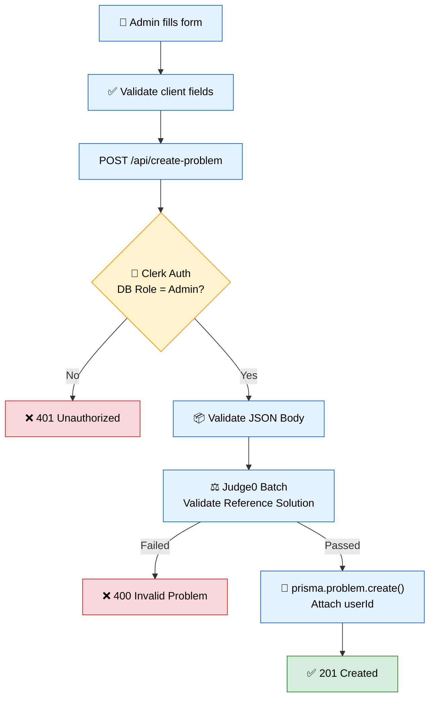

# LeetCode Clone — Learning Journal

> *A production-grade coding platform built from first principles.*
> *Focus: timeless software fundamentals, not framework-specific knowledge.*

---

## Preview

Here is a preview of the application:

<!-- Please save the images you pasted into the `public/` folder and replace these paths if they differ -->
<div align="center">
  
  
</div>
<div align="center">
  
  
</div>

---

## Learning Concepts

<details>
<summary><strong>1. What is an ORM?</strong></summary>

**Core Problem:** Applications speak in **objects** (TypeScript classes, interfaces). Databases speak in **tables and SQL**. These two worlds have fundamentally different languages and structures.

**Solution (ORM — Object Relational Mapping):** A translation layer that maps:
- Database tables → Application objects
- Database rows → Object instances
- Foreign key relationships → Nested object properties

**Analogy:** A diplomat translating between English and French at the UN.

**Trade-offs:**

| Pros | Cons |
|------|------|
| Developer productivity (less boilerplate) | Performance overhead vs raw SQL |
| Type safety | Black box (don't control generated SQL) |
| Database-agnostic (swap engines easily) | Complex queries may still need raw SQL |

</details>

---

<details>
<summary><strong>2. What is Prisma?</strong></summary>

**Definition:** Prisma is a **schema-first, type-safe database toolkit** — more than just an ORM.

**Core Innovation:** You declare your data model once in `schema.prisma`, and Prisma **generates** everything else:
- TypeScript types (compile-time safety)
- SQL migrations (schema evolution)
- A fully typed query client

**Traditional ORM flow:** Database exists → You define classes → Manual types → Runtime errors

**Prisma flow:** You write schema → Prisma generates types + client + migrations → Compile-time safety

**Key difference:** No magic lazy loading. You must **explicitly** include relations with `include` or `select`. This prevents N+1 query problems.

</details>

---

<details>
<summary><strong>3. What are Migrations?</strong></summary>

**Core Problem:** Database schemas evolve over time. Adding a column to a table with millions of rows is delicate. Managing changes across dev, staging, and production manually leads to drift and data loss.

**Solution:** Migrations are **version-controlled scripts** that evolve your database schema safely and reproducibly.

```sql
-- UP (apply changes)
ALTER TABLE users ADD COLUMN name VARCHAR(255);

-- DOWN (rollback changes)
ALTER TABLE users DROP COLUMN name;
```

**Prisma migrations are auto-generated:**
```bash
npx prisma migrate dev --name add_user_name
```

| Concept | Real-world analogy |
|---------|-------------------|
| Migration file | A git commit for your database |
| UP | Adding a room to your house |
| DOWN | Removing that room (restoring blueprint) |
| `_prisma_migrations` table | Git log — tracks which migrations applied |

</details>

---

<details>
<summary><strong>4. Dependencies vs DevDependencies</strong></summary>

**Core Principle: Build-time vs Runtime**

| Aspect | `dependencies` | `devDependencies` |
|--------|---------------|-------------------|
| When needed | When your app **runs** | When you're **building/testing** |
| Ships to production? | ✅ Yes | ❌ No |

**In our project:**

```json
{
  "dependencies": {
    "@prisma/client": "^7.8.0"
  },
  "devDependencies": {
    "prisma": "^7.8.0"
  }
}
```

**Why separate?** Smaller production bundles, smaller security surface, efficient Docker images.

</details>

---

<details>
<summary><strong>5. What is a Model?</strong></summary>

**General Definition:** A **model** is a structured representation of a real-world concept within your system.

**Three layers of "model" in software:**

| Layer | What it represents | Example |
|-------|-------------------|---------|
| **Domain Model** | Business concepts + behavior | `User.solve(problem)` |
| **Data Model** | Storage structure | `CREATE TABLE users (...)` |
| **Object Model** | In-memory representation | `interface User { id, email }` |

**Prisma's innovation:** Prisma models **collapse the Data Model + Object Model** into one declaration. The same `schema.prisma` generates both SQL DDL and TypeScript types.

```prisma
model User {
  id       Int    @id @default(autoincrement())
  email    String @unique
  username String @unique
  role     Role   @default(USER)
}
```

This generates: `CREATE TABLE "User"`, `interface User`, `prisma.user.findMany(...)`.

</details>

---

<details>
<summary><strong>6. PrismaClient & The Adapter Pattern</strong></summary>

**PrismaClient:** The runtime object your application code uses to communicate with the database.

```typescript
const prisma = new PrismaClient();
await prisma.user.findMany({ where: { role: 'ADMIN' } });
```

**The Adapter Pattern (PrismaPg):** Prisma is generic — it needs a **driver** specific to your database engine.

```
PrismaClient → PrismaPg adapter → PostgreSQL
 (generic)      (PostgreSQL driver)   (database)
```

**Analogy:** PrismaClient is your phone (USB-C charger). PrismaPg is the country-specific plug adapter. PostgreSQL is the wall outlet.

</details>

---

<details>
<summary><strong>7. The Singleton Pattern & HMR Problem</strong></summary>

**The Problem:** In development, Next.js uses **Hot Module Replacement (HMR)**. When you save a file, the module reloads without a full page refresh. If your database connection file creates a **new PrismaClient** on each reload:

```
Save file → HMR → New PrismaClient → New connection to PostgreSQL
Save again → HMR → Another PrismaClient → Another connection
... (repeat many times)

PostgreSQL: "Too many connections!" ❌
```

**The Solution: Singleton on globalThis**

```typescript
const globalForPrisma = globalThis as unknown as {
  prisma: PrismaClient | undefined
}

export const prisma = globalForPrisma.prisma ?? new PrismaClient({
  adapter: new PrismaPg({ connectionString: process.env.DATABASE_URL }),
})

if (process.env.NODE_ENV !== "production") {
  globalForPrisma.prisma = prisma;
}
```

**How it works:**

| Load Event | `globalThis.prisma` | Result |
|------------|--------------------|--------|
| First load | `undefined` | Creates new PrismaClient, stores on `globalThis` |
| HMR reload | Existing PrismaClient | Reuses existing — NO new connection |
| Production | N/A | Module loads once per process anyway |

**Why `globalThis`?** It survives HMR reloads. Your module's local variables reset, but `globalThis` persists for the life of the process.

</details>

---

<details>
<summary><strong>8. Type Assertions in TypeScript</strong></summary>

**Core Concept:** `as` is a **compile-time type assertion**, not a runtime transformation.

```typescript
const globalForPrisma = globalThis as unknown as { 
  prisma: PrismaClient | undefined 
}
```

**What it is:** A label telling TypeScript "trust me, this is safe". It does NOT create a new object or transform the existing one. **It disappears entirely during compilation.**

**Two-step cast explained:**
1. `globalThis as unknown` — TypeScript allows converting anything to `unknown`
2. `unknown as { prisma: ... }` — TypeScript allows converting `unknown` to anything

Without the double cast, TypeScript complains that `typeof globalThis` and `{ prisma: ... }` have zero overlap.

</details>

---

<details>
<summary><strong>9. Database Providers: Neon vs Docker Compose</strong></summary>

| Aspect | Neon (Cloud) | Docker Compose (Local) |
|--------|-------------|----------------------|
| Setup | 2 minutes (sign up, create project) | 5 minutes (install Docker, write compose) |
| Cost | Free tier available | Free (runs on your machine) |
| Internet | ✅ Required | ❌ Not required |
| Maintenance | Managed (backups, scaling) | You handle it |

**Prisma doesn't care which one.** It just needs a `DATABASE_URL` in `.env`.

</details>

---

<details>
<summary><strong>10. What is Clerk?</strong></summary>

**Definition:** Clerk is a **User Management & Authentication Platform as a Service**. It handles the complex security infrastructure of authentication so you don't have to build it yourself.

**The problem it solves:** Building authentication from scratch requires solving dozens of hard problems — password hashing, session management, JWT signing, OAuth flows, email verification, CSRF protection, rate limiting, MFA, and more. Getting any of these wrong compromises your users' security.

**What Clerk provides:**
- Pre-built sign-in/sign-up UI components (`<SignIn />`, `<SignUp />`)
- Session management (cookies, JWTs, token refresh)
- OAuth providers (Google, GitHub, 30+ more)
- User profile management (`<UserButton />`, `<UserProfile />`)
- Server helpers (`auth()`, `currentUser()`)
- Middleware for route protection (`clerkMiddleware()`)
- Admin dashboard for managing users

**Analogy:** Clerk is like a hotel's **front desk** — they handle check-in, keys, and identity verification. You handle what happens inside the room (your application logic).

**How it fits in our stack:**

```
proxy.ts (clerkMiddleware) → checks session → protects routes
    ↓
layout.tsx (ClerkProvider) → provides user context to components
    ↓
Your components (auth()) → reads user ID for database queries
```

</details>

---

<details>
<summary><strong>11. What is <code>clerkMiddleware()</code>?</strong></summary>

**Definition:** A request interceptor that runs on every incoming HTTP request **before** it reaches your route handler.

**What it does:**
1. Reads the session cookie from the request
2. Verifies the JWT signature using your `CLERK_SECRET_KEY`
3. Checks if the session is expired
4. If invalid/expired → redirects to `/sign-in`
5. If valid → attaches user info to the request and passes through

**Analogy:** The **bouncer** at a club entrance — checks ID before letting anyone in.

**Our proxy.ts (middleware file):**

```typescript
import { clerkMiddleware, createRouteMatcher } from "@clerk/nextjs/server";

const isPublicRoute = createRouteMatcher(["/sign-in(.*)", "/sign-up(.*)"]);

export default clerkMiddleware(async (auth, req) => {
  if (!isPublicRoute(req)) {
    await auth.protect();
  }
})

export const config = {
  matcher: [
    '/((?!_next|.*\\..*).*)',
    '/(api|trpc)(.*)',
    '/__clerk/(.*)',
  ],
}
```

**Key concepts:**
- `createRouteMatcher(["..."])` — Defines which routes are public (no auth required)
- `auth.protect()` — Blocks the request if no valid session exists
- `matcher` config — Tells Next.js which routes should trigger the middleware (avoids running on static files)

</details>

---

<details>
<summary><strong>12. Route Groups <code>(auth)</code></strong></summary>

**Definition:** A folder wrapped in parentheses `()` is a **route group** — it's ignored in the URL path. Used purely for organizing related routes.

**The problem:** Without route groups, every folder in `app/` maps to a URL segment. To group auth pages, you'd get `/auth/sign-in` instead of `/sign-in`.

**Solution:**

```
app/
├── (auth)/                  ← Not a URL segment
│   ├── sign-in/
│   │   └── page.tsx         →  /sign-in
│   └── sign-up/
│       └── page.tsx         →  /sign-up
│
├── problems/
│   └── page.tsx             →  /problems
│
└── page.tsx                 →  /
```

**Benefits:**
- Organizes related pages without affecting URLs
- Can have its own `layout.tsx` that only applies to auth pages
- Root layout still wraps everything — route group layouts are **nested inside**, not replacing

**Layout hierarchy:**

```
<RootLayout>                    ← app/layout.tsx (html, body, ClerkProvider)
  <AuthLayout (optional)>       ← app/(auth)/layout.tsx (centered card)
    <SignInPage />
  </AuthLayout>
</RootLayout>
```

</details>

---

<details>
<summary><strong>13. Optional Catch-All Routes <code>[[...param]]</code></strong></summary>

**Definition:** A route pattern that matches both the root path AND any sub-paths underneath it.

**The problem:** Clerk's `<SignIn />` handles multiple stages — `/sign-in`, `/sign-in/forgot-password`, `/sign-in/sso-callback`. You don't know all sub-paths Clerk might use.

**Solution:** `[[...sign-in]]` — the optional catch-all:

```
app/(auth)/sign-in/[[...sign-in]]/page.tsx

/sign-in              →  matches ✅ (slug = undefined)
/sign-in/forgot-password → matches ✅ (slug = ["forgot-password"])
/sign-in/sso/callback →  matches ✅ (slug = ["sso", "callback"])
```

**Syntax comparison:**

| Pattern | `/sign-in` | `/sign-in/forgot` |
|---------|-----------|------------------|
| `[slug]` | ❌ No match | ✅ `slug = "forgot"` |
| `[...slug]` | ❌ No match | ✅ `slug = ["forgot"]` |
| `[[...slug]]` | ✅ `slug = undefined` | ✅ `slug = ["forgot"]` |

**The double brackets `[[ ]]` make it optional** — without them, `/sign-in` would return 404.

</details>

---

<details>
<summary><strong>14. Layout Nesting: Root vs Route Group Layouts</strong></summary>

**Core rule:** Layouts **nest**, they don't **replace**. A route group layout is always nested inside the root layout.

| Question | Answer |
|----------|--------|
| Does auth layout **replace** root layout? | ❌ No |
| Is auth layout **nested inside** root layout? | ✅ Yes |
| What if no auth layout exists? | Page goes directly inside root layout |

**Visual hierarchy:**

```
┌──────────────────────────────────────────────────────┐
│  Root Layout (app/layout.tsx)                        │
│  ┌─ <html> ──────────────────────────────────────┐  │
│  │  <body>                                       │  │
│  │  Navbar, Footer, ClerkProvider                │  │
│  │                                               │  │
│  │  ┌─ Auth Layout (app/(auth)/layout.tsx) ───┐ │  │
│  │  │  Centered card, no navbar               │ │  │
│  │  │  ┌─ <SignIn /> ──────────────────────┐  │ │  │
│  │  │  └───────────────────────────────────┘  │ │  │
│  │  └─────────────────────────────────────────┘ │  │
│  └───────────────────────────────────────────────┘  │
└──────────────────────────────────────────────────────┘
```

</details>

---

<details>
<summary><strong>15. Null Safety in Auth Functions</strong></summary>

**Core Problem:** Clerk's `auth()` returns `userId: string | null`, but Prisma expects `string | undefined`.

```typescript
const { userId } = await auth()
await prisma.user.findUnique({ where: { clerkId: userId } })
// error: null not assignable to undefined
```

**Fix:** Early return pattern

```typescript
export async function getCurrentUserRole() {
  const { userId } = await auth()
  if (!userId) return null
  const user = await prisma.user.findUnique({
    where: { clerkId: userId },
    select: { role: true }
  })
  return user?.role
}
```

**Golden Rule:** Handle null explicitly before any Prisma query.

</details>

---

<details>
<summary><strong>16. <code>id</code> vs <code>clerkId</code> — Two ID Spaces</strong></summary>

**Core Problem:** Your app touches two systems with different ID schemes.

```
Clerk: "user_2qX8..."    You: "cly8h3j2..."
(clerkId)                (id)
```

**Rule of Thumb:**

> Use `clerkId` **once** to find the user. Then use your internal `id` forever.

```typescript
const { userId: clerkId } = await auth()
const user = await prisma.user.findUnique({ where: { clerkId } })
await prisma.submission.create({ data: { userId: user.id } })
```

| | `id` | `clerkId` |
|---|------|----------|
| Who assigns? | Your system | Clerk |
| Used in foreign keys? | All your tables | Never |
| Survives provider swap? | Yes | No |

</details>

---

<details>
<summary><strong>17. upsert — Atomic Create-or-Update</strong></summary>

One operation: create if missing, update if exists. No race conditions.

```typescript
const user = await prisma.user.upsert({
  where: { clerkId: "abc" },
  update: { lastActiveAt: new Date() },
  create: { clerkId: "abc", xp: 0 }
})
```

Best for: Lazy user creation on first visit.

</details>

---

<details>
<summary><strong>18. Enums: Prisma vs TypeScript</strong></summary>

Prisma enums generate BOTH a database ENUM type AND a TypeScript enum from one definition.

```prisma
enum Difficulty {
  EASY
  MEDIUM
  HARD
}
```

Generates:
- PostgreSQL: `CREATE TYPE "Difficulty" AS ENUM (...)`
- TypeScript: `export enum Difficulty { EASY = 'EASY', ... }`

| Layer | When enforced |
|-------|--------------|
| TypeScript | Compile time |
| PostgreSQL | Runtime (DB constraint) |

Pure TS enum = compile-time only, no DB enforcement.

</details>

---

<details>
<summary><strong>19. TypeScript — Compile-Time Safety Layer</strong></summary>

TypeScript is a compile-time safety layer over JavaScript. Types are erased at runtime; only pure JS ships.

```
.ts (typed) → tsc → .js (no types) → runtime
```

What you get: Compile-time errors, autocomplete, self-documenting code.  
What you **don't** get: Runtime type checking.

**Analogy:** TypeScript is makeup on JavaScript's face — washed off at runtime.

</details>

---

<details>
<summary><strong>20. <code>createdAt</code> and <code>updatedAt</code></strong></summary>

Without timestamps, your database is a bag of unordered facts.

```prisma
createdAt DateTime @default(now())
updatedAt DateTime @updatedAt
```

| Use Case | Field |
|----------|-------|
| Newest first | `createdAt` |
| Recently active | `updatedAt` |
| Debugging | `updatedAt` |
| Retention analysis | `createdAt` |

Never omit them.

</details>

---

<details>
<summary><strong>21. Server Actions vs Route Handlers vs Server Components</strong></summary>

| Pattern | Purpose | When to Use |
|---------|---------|-------------|
| Server Component | Fetch data for render | 90% of pages |
| Route Handler | Shared API endpoint | Multiple consumers |
| Server Action | Form mutations | Forms, optimistic updates |

Server Actions are **mutation-only**. Using them for queries is an anti-pattern.

**Rule:** Fetching data → RSC. Forms → Server Action. Shared API → Route Handler.

</details>

---

<details>
<summary><strong>22. CSS Custom Properties as Design Tokens</strong></summary>

**Core Problem:** Color information scattered at every usage site — `text-gray-900 dark:text-white`, `text-amber-600 dark:text-amber-400` — 28+ pairs across multiple files. Changing the brand color requires a grep operation with no compile-time guarantee you found everything.

**Solution:** CSS custom properties are **pointers in the browser's cascade**. The component holds an indirection, not a literal. The `.dark` class on `<html>` redefines what the pointer points to — the component never changes.

```css
:root  { --amber-fill: oklch(0.72 0.22 86.05); }
.dark  { --amber-fill: oklch(0.78 0.22 85.67); }
```

```tsx
{/* One class — reads whichever value is active */}
className="bg-[var(--amber-fill)]"
```

**Why OKLCH over HSL?** OKLCH is perceptually uniform — equal chroma steps produce equal perceived saturation at any lightness. HSL is not: `hsl(84, 100%, 50%)` and `hsl(264, 100%, 50%)` appear wildly different in perceived brightness. OKLCH lets you build a balanced palette without manual correction.

**The token taxonomy we use:**

| Token suffix | Role |
|---|---|
| `--*-bg` | Tinted surface background |
| `--*-bg-hover` | Hover state of the surface |
| `--*-text` | Readable text on neutral backgrounds |
| `--*-text-emphasis` | Bold accent text, hover states |
| `--*-fill` | Solid button/badge background |
| `--*-border` | Card/input border |
| `--*-border-hover` | Border on card hover |

**Rule:** A CSS variable is cheaper than a JS theme context — zero JS executes, no hydration mismatch, resolved before first paint.

</details>

---

<details>
<summary><strong>23. Static Data Hoisting</strong></summary>

**Core Problem:** In Next.js, Server Components execute per request. Data arrays defined *inside* the component function are re-allocated on every request — new objects, new strings, work for the garbage collector.

```typescript
// ❌ Allocated on every request
export default async function Home() {
  const features = [{ icon: <Code2 />, title: "..." }]
}

// ✅ Allocated once at module import
export const features = [...] as const;
export default async function Home() { ... }
```

**The invariant:** Module scope is initialized **once** per process and never freed. It communicates intent: *"this data does not vary between requests."*

**The critical flip side — State Leak:** Only put **immutable** data at module scope. Mutable module-level state in a server handler is a production security bug — one user's data leaks into another user's response because server processes are shared. The rule:

> **Immutable → module scope. Request-scoped → function scope. Always.**

</details>

---

<details>
<summary><strong>24. JSX in Data Arrays — The Anti-Pattern</strong></summary>

**Core Problem:** Storing rendered JSX nodes inside data arrays mixes data with rendering concerns.

```typescript
// ❌ JSX in data — type is ReactNode, no closed-set guarantee
{ icon: <Code2 className="w-6 h-6" />, title: "Interactive Coding" }

// ✅ String identifier — type is "code", closed-set enforced
{ icon: "code" as const, title: "Interactive Coding" }
```

**Why this matters:**

1. **Type safety:** `"code" | "trophy" | "users" | "zap"` is a closed union. Misspell it → TypeScript error at compile time. With JSX, only runtime errors after render.
2. **Separation of concerns:** The data array describes *what* exists (identity). The icon map describes *how* to render it (behavior). Changing icon size, color, or adding accessibility props no longer requires editing the data.
3. **The icon map pattern:**

```typescript
const iconMap: Record<FeatureIcon, LucideIcon> = {
  code: Code2,
  trophy: Trophy,
  users: Users,
  zap: Zap,
};

const Icon = iconMap[feature.icon]; // TypeScript verifies this key exists
return <Icon className="w-6 h-6" />;
```

If you add `"chart"` to the data but forget to add it to `iconMap`, TypeScript errors immediately.

</details>

---

<details>
<summary><strong>25. Stable React Keys</strong></summary>

**Core Problem:** React's reconciler uses `key` to decide whether to **reuse** or **destroy and recreate** a DOM node. Array index as key breaks this when lists are reordered or filtered.

```tsx
// ❌ Index key — breaks on reorder/filter
{stats.map((stat, index) => <div key={index}>)}

// ✅ Stable ID — survives any list operation
{stats.map((stat) => <div key={stat.id}>)}
```

**Why it breaks with index:** If you remove index 0, everything shifts. React reuses the DOM node for the old index 0 and patches it with new data — any transition animation, focus state, or input value on that node is now wrong. Users see visual glitches.

**The analogy:** A `key` should identify the **entity**, not its **position** — exactly why databases use UUIDs as primary keys instead of row numbers.

**The practical rule:** For any list that will ever be filtered, sorted, or paginated — use a stable ID. For 100% static, never-reordered lists, index is technically safe but a bad habit.

</details>

---

<details>
<summary><strong>26. Derived Values & Color Lookup Maps</strong></summary>

**Core Problem:** Coupled ternaries that branch on the same expression create a silent divergence risk.

```tsx
{/* ❌ Two separate gates for one decision — can silently diverge */}
className={`
  ${index % 2 === 0 ? "bg-amber-100" : "bg-indigo-100"}
  ${index % 2 === 0 ? "text-amber-600" : "text-indigo-600"}
`}
```

**Solution:** Derive the decision **once**, then look up all consequences from a map.

```typescript
// Derived once — single source of truth
const colorScheme = featureColorCycle[index]; // "amber" | "indigo"

// Lookup maps at module scope — O(1), type-checked
const iconClasses: Record<CategoryColor, string> = {
  amber: "bg-[var(--amber-bg)] text-[var(--amber-text-emphasis)]",
  indigo: "bg-[var(--indigo-bg)] text-[var(--indigo-text-emphasis)]",
};

// Render reads one value
className={iconClasses[colorScheme]}
```

**The scalability payoff:** When you add `"rose"` as a third color, TypeScript immediately errors on every `Record<CategoryColor, string>` map that doesn't include `"rose"`. You cannot forget to handle the new case — the type system finds every location for you.

**The broader pattern:** Anywhere you write `if (x === "a") ... else if (x === "b") ...` in JSX, ask: *should this be a lookup map?* This pattern scales to: difficulty → color, user role → permissions, plan tier → feature flags.

</details>

---

<details>
<summary><strong>27. Component Extraction — When and Why</strong></summary>

**Core Problem:** A 240-line `page.tsx` mixing server data fetching, hero layout, feature grid, category cards, and a CTA banner is impossible to test in isolation, reuse, or reason about under pressure.

**The extraction rule — not "is it big?" but:**
> Does this piece have an **independent reason to change**, or is it **reused** in more than one place?

If yes to either → extract. If no to both → inline is fine.

**Rate-of-change analysis for our page:**

| Component | Changes when… | Extract? |
|---|---|---|
| `HeroSection` | Marketing copy, A/B test | ✅ Independent change |
| `FeaturesSection` | Product adds a feature | ✅ Independent change |
| `CategoriesSection` | Difficulty levels change | ✅ Will be reused on `/problems` |
| `CtaSection` | Growth team messaging | ✅ Independent change |

**Result:** `page.tsx` becomes an 18-line orchestrator. Each component owns exactly its slice of the page, with its own color maps and imports — fully self-contained.

```
modules/home/components/
├── hero-section.tsx       ← badge, heading, CTA buttons, stats
├── features-section.tsx   ← feature cards with icon map
├── categories-section.tsx ← difficulty cards with color maps
└── cta-section.tsx        ← gradient CTA banner
```

**The architectural principle:** Components are not just visual units — they are **units of independent change**. Extract at the boundary where two things change for different reasons.

</details>

---

<details>
<summary><strong>28. Judge0 — The Code Execution Engine</strong></summary>

**Core Problem:** Running arbitrary user code on your own server is one of the most dangerous things in software engineering. A user can submit an infinite loop, read your filesystem, open network sockets, or fork thousands of processes — crashing your server for every other user.

**What Judge0 is:** An open-source sandboxed code execution system. It accepts a code submission, runs it inside an isolated container with hard resource limits, and returns the result.

**The sandbox is built on Linux kernel primitives:**

| Primitive | What it enforces |
|---|---|
| `cgroups` | CPU time limit, memory limit |
| `namespaces` | Filesystem and network isolation |
| `seccomp` | Syscall filtering — blocks dangerous system calls |

These are the same primitives Docker is built on. Each submission gets its own isolated process that cannot see your server's filesystem, network, or other processes.

**What it returns per submission:**

| Field | Meaning |
|---|---|
| `stdout` | What the code printed |
| `stderr` | Error output |
| `status` | Accepted / Wrong Answer / TLE / Runtime Error / Compilation Error |
| `time` | Execution time in seconds |
| `memory` | Memory used in KB |

**Where it fits in the stack:**

```
Browser → submits code
    ↓
Next.js Route Handler  ← validates, authenticates, rate-limits
    ↓
Judge0 API             ← sandboxed execution
    ↓
Route Handler          ← stores result in DB, returns to browser
```

**The rule:** Judge0 is a **pure function** — input goes in, output comes out. It has no side effects on your system. Your backend owns all persistence, all business logic, all error responses.

**Deployment options:**

| Option | Setup | Cost at scale | Control |
|---|---|---|---|
| RapidAPI (hosted) | 2 minutes | Expensive per-request | None |
| Self-hosted | Hours (Docker + Linux) | Cheap (your server) | Full |

</details>

---

<details>
<summary><strong>29. RapidAPI — The API Marketplace</strong></summary>

**What it is:** An API marketplace — the App Store for APIs. One account, one key, one billing dashboard for thousands of third-party APIs (Judge0, weather, currency, translation, etc.).

**The proxy architecture:** RapidAPI sits between your server and the API provider as a reverse proxy. Your key authenticates you to RapidAPI; the provider never sees your identity.

```
Your server → RapidAPI Gateway (auth + rate limit) → Judge0 servers → back
```

**The two required headers on every call:**

| Header | Purpose |
|---|---|
| `X-RapidAPI-Key` | Your personal key — authenticates you |
| `X-RapidAPI-Host` | Which API to route to (e.g. `judge0-ce.p.rapidapi.com`) |

**The security rule:** Your RapidAPI key must **never touch the browser**. It lives only in server environment variables. All Judge0 calls go through your Route Handler, which adds the key server-side. This is the BFF pattern — your server is the only entity that knows the key exists.

</details>

---

<details>
<summary><strong>30. Polling vs Webhooks</strong></summary>

**The problem:** You need to know when something finishes at an unpredictable time in the future (Judge0 execution, Stripe payment, GitHub push).

**Polling (Pull):** You repeatedly ask "is it done yet?" on a timer. Wasted requests, delay equal to polling interval, expensive at scale.

**Webhooks (Push):** You give the provider your server's URL. When they finish, they POST the result to you. One request, zero waste, near-instant.

**The doorbell analogy:** Polling = walking to the front door every 10 minutes to check for a package. Webhook = the driver rings your doorbell when they arrive.

**The critical constraint webhooks introduce:** Your server must be **reachable from the public internet**. `localhost:3000` is not. This is fine in production (real domain) but requires a tunnel tool like ngrok in local development.

**The security problem:** Anyone can POST to your webhook URL. A malicious actor could send fake "Accepted" results. The solution is a **webhook secret** — the provider signs requests with an HMAC hash. Your server verifies the signature before trusting the payload.

| Concern | Polling | Webhooks |
|---|---|---|
| Simplicity | Simple — just a loop | Complex — public URL, signature verification |
| Latency | Up to polling interval | Near-instant |
| Wasted requests | Many | Zero |
| Works on localhost | ✅ Yes | ❌ Needs tunnel |
| Scale cost | High | Low |

**Practical decision:** Polling (or Judge0's synchronous mode) for local development. Webhooks for production at scale.

</details>

---

<details>
<summary><strong>31. ngrok — A Tunnel to Localhost</strong></summary>

**The problem:** Webhook providers need a public URL to POST back to. `localhost:3000` is unreachable from the internet.

**What ngrok does:** Runs a process on your machine that opens an outbound connection to ngrok's public servers, then gives you a real URL (`https://abc123.ngrok.io`) that forwards all requests through that tunnel to your local port.

```
Provider → POST https://abc123.ngrok.io/api/webhook
                ↓ (tunnel, outbound connection already open)
           your laptop → localhost:3000/api/webhook
```

**Why it works through firewalls:** Your machine initiates the outbound connection — firewalls block inbound connections, not outbound. ngrok's server just relays through the already-open tunnel.

**The rule:** Strictly a local development tool. In production, your server has a real domain — ngrok is irrelevant.

</details>

---

<details>
<summary><strong>32. The Problem Model — Schema Design Decisions</strong></summary>

**Our `Problem` model in `schema.prisma`:**

```prisma
model Problem {
  id                 String     @id @default(cuid())
  userId             String
  title              String
  description        String
  difficulty         Difficulty
  tags               String[]
  examples           Json
  constraints        String
  hints              String?
  editorial          String?
  testCases          Json
  codeSnippets       Json
  referenceSolutions Json
  createdAt          DateTime   @default(now())
  updatedAt          DateTime   @updatedAt
  user               User       @relation(fields: [userId], references: [id], onDelete: Cascade)
}
```

**Key decisions and why:**

**`Json` for `testCases`, `codeSnippets`, `referenceSolutions`, `examples`**
These fields are structured but variable — test cases have inputs and expected outputs, code snippets vary per language, reference solutions vary per language. Storing them as `Json` avoids creating separate tables for each. The trade-off: no column-level indexing or type safety at the DB layer — you validate structure in your application code.

**`String[]` for `tags`**
PostgreSQL natively supports array columns. A `tags` array on the problem row avoids a separate join table for a simple many-to-many that you only ever query as "give me all tags for this problem." The trade-off: you cannot query "all problems with tag X" efficiently without a GIN index.

**`hints` and `editorial` as optional (`?`)**
Not every problem has hints or an editorial on creation. Making them nullable means the admin can publish a problem first and add editorial content later — a real product workflow.

**`onDelete: Cascade`**
If the user who created a problem is deleted, all their problems are deleted too. This prevents orphaned rows with a `userId` pointing to a non-existent user.

**`difficulty` as a Prisma enum**
Enforced at both the TypeScript layer (compile time) and PostgreSQL layer (runtime DB constraint). A raw `String` field would allow `"VERY_HARD"` or `"easy"` to slip through — the enum makes that impossible at the database level.

</details>

---

<details>
<summary><strong>33. Responsive Navbar — The Architecture</strong></summary>

**The core problem:** A navbar with three horizontal zones (logo, nav links, auth buttons) overflows on a 375px mobile screen. You have two fundamentally different layout needs for the same content.

**The two concepts used:**

**1. Responsive visibility (`hidden md:flex` / `md:hidden`)**
Tailwind's `md:` prefix is a min-width breakpoint at 768px. Elements are never removed from the DOM — one is `display: none` at each breakpoint. Desktop links get `hidden md:flex`. The hamburger button gets `md:hidden`.

**2. Controlled open/close state (`useState`)**
The hamburger toggle requires interactive state — the navbar must become a Client Component (`"use client"`). The architectural rule: keep a Server Component wrapper that reads auth data and passes it as props; make only the interactive shell a client component. The `userRole` prop pattern already satisfies this.

**Auto-close on navigation (`usePathname` + `useEffect`)**
Without this, the sheet stays open after the user taps a link. `usePathname()` from `next/navigation` gives the current route. A `useEffect` watching `pathname` calls `setOpen(false)` — handles both link clicks and the browser back button.

**Why shadcn `<Sheet>` over a hand-rolled dropdown:**
Sheet handles focus trapping, backdrop dismiss, `Escape` key, scroll lock, `role="dialog"`, and `aria-modal` out of the box. Hand-rolling these correctly takes hours and is easy to get wrong for screen readers.

**The final structure:**

```
Navbar (client component)
├── Top bar
│   ├── Logo                          always visible
│   ├── Nav links   (hidden md:flex)  desktop only
│   ├── Auth buttons (hidden md:flex) desktop only
│   └── Hamburger   (md:hidden)       mobile only
└── Sheet (right drawer)
    ├── Nav links
    └── Auth buttons (full-width, bottom-anchored)
```

</details>

---

<details>
<summary><strong>34. Typing Props Precisely — Replacing <code>any</code></strong></summary>

**The problem:** `({ userRole }: any)` opts out of type checking entirely. TypeScript will never catch a wrong value being passed.

**The fix:** Type the prop to exactly match what the data source returns.

`getCurrentUserRole()` returns `user?.role` — which is `Role | null | undefined`:

| Value | When |
|---|---|
| `Role.ADMIN` or `Role.USER` | Authenticated, user exists in DB |
| `null` | No Clerk session |
| `undefined` | Authenticated but user record not yet in DB |

**Why `Role` must be a regular import, not `import type`:**
`import type` is erased entirely before the JS runs. `Role` is used as a **runtime value** in `=== Role.ADMIN` comparisons — if it's erased, the comparison throws a reference error at runtime. `import type` is only correct for types that are purely used as type annotations and never referenced in executed code.

**The rule:** If a value from an import appears in a runtime expression (comparisons, function calls, `instanceof`), use a regular import. Use `import type` only when the import is used exclusively as a TypeScript type annotation.

</details>

---

## Project Structure

```
leetcode-clone/
├── app/                          # Next.js App Router
│   ├── (auth)/                   # Auth route group (sign-in, sign-up)
│   ├── (root)/                   # Main app route group
│   │   ├── problems/             # Problems listing page
│   │   ├── profile/              # User profile page
│   │   └── create-problem/         # Problem creation page
│   ├── api/                      # API route handlers
│   │   ├── create-problem/         # Problem creation endpoint
│   │   ├── playlist/             # Playlist CRUD endpoints
│   │   └── playlist/add-problem/   # Add problem to playlist
│   ├── problem/[id]/             # Dynamic problem page
│   ├── layout.tsx                # Root layout (ClerkProvider, ThemeProvider)
│   └── proxy.ts                  # Clerk middleware
│
├── components/                   # Shared UI components
│   └── ui/                       # shadcn/ui components
│
├── hooks/                        # Custom React hooks
│   ├── use-problem.ts            # Fetch single problem
│   ├── use-create-problem.ts     # Create problem hook
│   └── use-mobile.ts             # Mobile detection hook
│
├── lib/                          # Core utilities
│   ├── db.ts                     # Prisma client singleton
│   ├── judge0.ts                 # Judge0 API client
│   ├── utils.ts                  # Utility functions
│   └── data/                     # Server actions
│       ├── problems.ts           # Problem CRUD, code execution
│       └── user.ts               # User auth utilities
│
├── modules/                      # Feature modules
│   ├── auth/                     # Authentication
│   ├── home/                     # Landing page components
│   ├── problems/                 # Problem-related components
│   │   ├── component/            # Problem UI components
│   │   ├── hooks/                # Problem hooks
│   │   └── schemas/              # Zod validation schemas
│   └── profile/                  # Profile page components
│
├── prisma/                       # Database
│   ├── schema.prisma             # Data models
│   └── migrations/               # SQL migration files
│
├── providers/                    # Context providers
│   └── theme-provider.tsx        # Theme context
│
└── public/                       # Static assets
    ├── preview1.png              # App screenshots
    └── ...
```

---

## Tech Stack

| Layer | Technology | Purpose |
|-------|------------|---------|
| **Framework** | Next.js 16 | React framework with App Router |
| **Language** | TypeScript | Type-safe JavaScript |
| **Database** | PostgreSQL | Relational database |
| **ORM** | Prisma | Type-safe database client |
| **Auth** | Clerk | User management & authentication |
| **Code Editor** | Monaco | VS Code editor in browser |
| **Code Execution** | Judge0 | Sandboxed code execution |
| **UI** | shadcn/ui | Accessible component library |
| **Styling** | Tailwind CSS | Utility-first CSS framework |
| **State** | React Hooks | Client-side state management |
| **Validation** | Zod | Schema validation |
| **HTTP Client** | Axios | API requests |

---

## How to Run the Project

### Prerequisites
- Node.js 18+
- PostgreSQL database (or Neon account)
- Clerk account (for auth)
- RapidAPI account (for Judge0)

### 1. Clone and Install
```bash
git clone https://github.com/usamaElsharkawi/leetcode-clone.git
cd leetcode-clone
npm install
```

### 2. Environment Variables
Create `.env` file:
```env
DATABASE_URL="postgresql://..."
CLERK_SECRET_KEY="sk_..."
CLERK_PUBLISHABLE_KEY="pk_..."
JUDGE0_API_KEY="your-rapidapi-key"
JUDGE0_API_HOST="judge029.p.rapidapi.com"
```

### 3. Database Setup
```bash
# Generate Prisma client
npx prisma generate

# Run migrations
npx prisma migrate dev

# (Optional) View database
npx prisma studio
```

### 4. Start Development Server
```bash
npm run dev
```

Open [http://localhost:3000](http://localhost:3000) to view the app.

### 5. Build for Production
```bash
npm run build
npm start
```

---

## System Architecture

<details>
<summary><strong>Create Problem Flow</strong></summary>



**Key architectural rules this diagram enforces:**

- **Judge0 never touches the database.** It is a pure execution sandbox — input goes in, stdout/stderr/status comes out. It has no knowledge of your schema, your auth, or your business rules.
- **Your backend owns the validation gate.** Judge0 answers "here is what the code printed." Your backend answers "did all test cases produce the expected output?" That business logic lives in your code.
- **Your backend is the only entity that writes to the database.** No third-party service gets a direct path to persistence — every external system communicates with your backend only.

</details>

---

<details>
<summary><strong>Create Problem — Detailed Request Lifecycle</strong></summary>

This diagram zooms into the full request lifecycle: from the admin filling the form, through auth, validation, Judge0 execution, and final persistence.



**Each gate and what it enforces:**

| Step | Layer | Why it exists |
|---|---|---|
| Client field validation | Browser | Fast feedback before a network round-trip. Never the security boundary — just UX. |
| Clerk Auth + DB Role check | Route Handler | The real security gate. Middleware alone is not enough — the handler must re-verify. A non-admin with a valid session would pass middleware but fail here. |
| JSON body validation | Route Handler | Ensures the payload shape is correct before touching Judge0 or the DB. Rejects garbage early. |
| Judge0 batch execution | External service | Verifies the reference solution actually solves all test cases. Prevents broken problems being published. |
| `prisma.problem.create()` | Database | Only reached if every gate above passed. The `userId` is taken from the server-side auth call — never from the request body. |

**The security rule this lifecycle enforces:**

> The `userId` attached to the problem comes from `auth()` on the server, never from the request body. A client sending `{ userId: "someOtherUser" }` is ignored — the server substitutes the authenticated identity.

</details>
